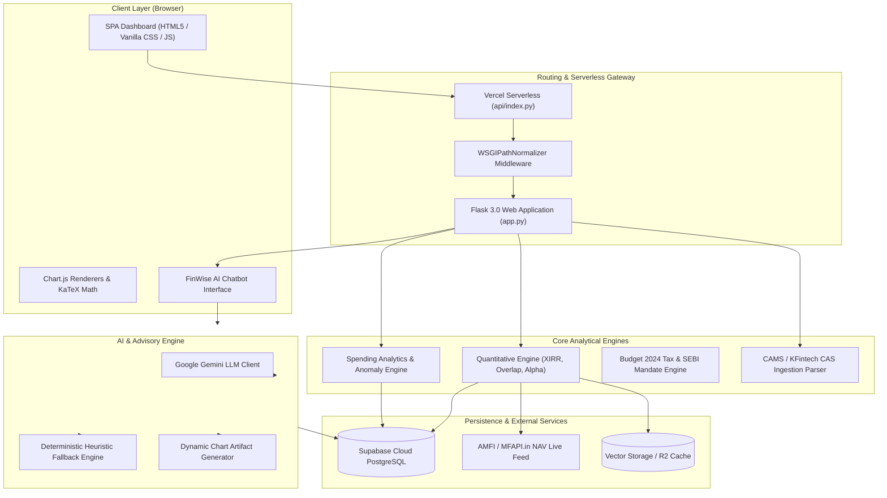
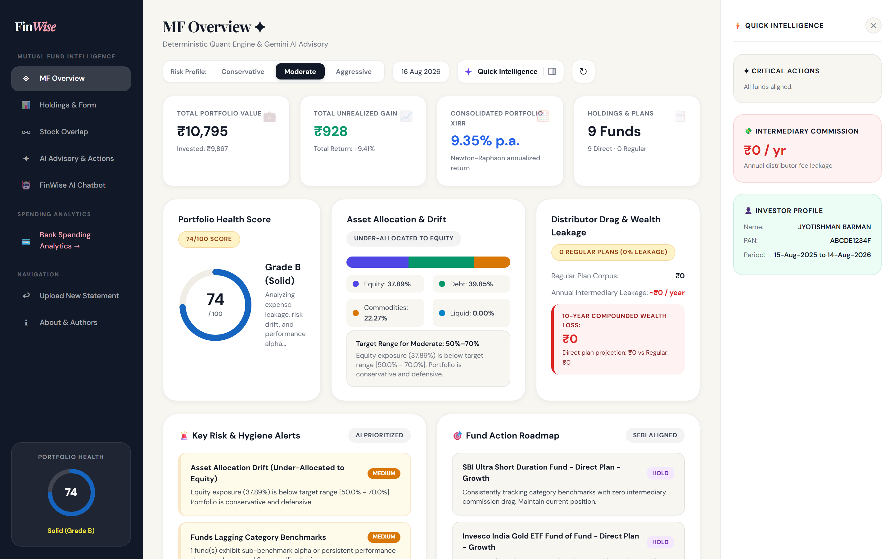
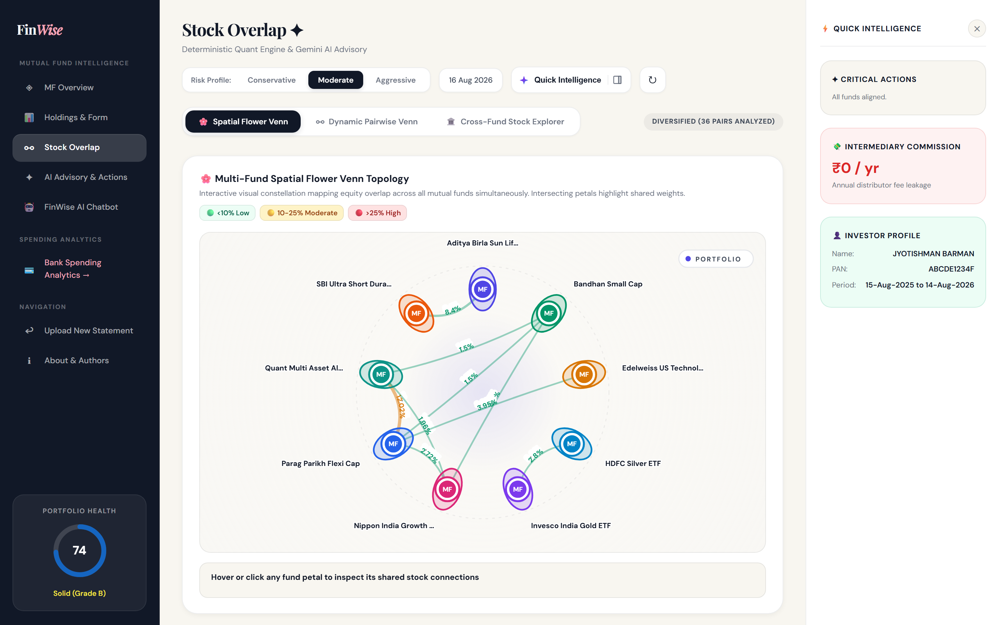
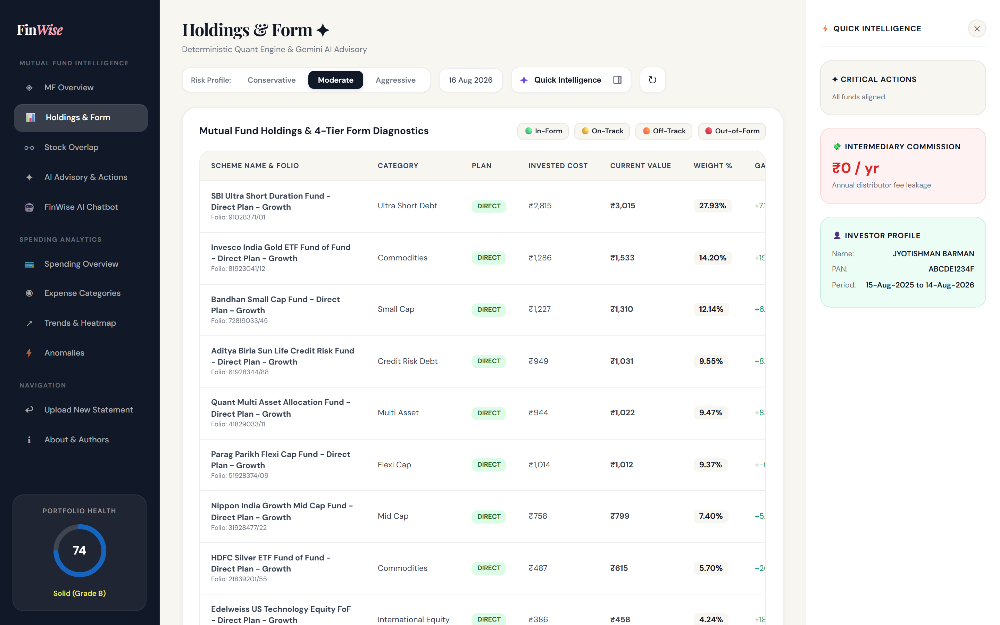
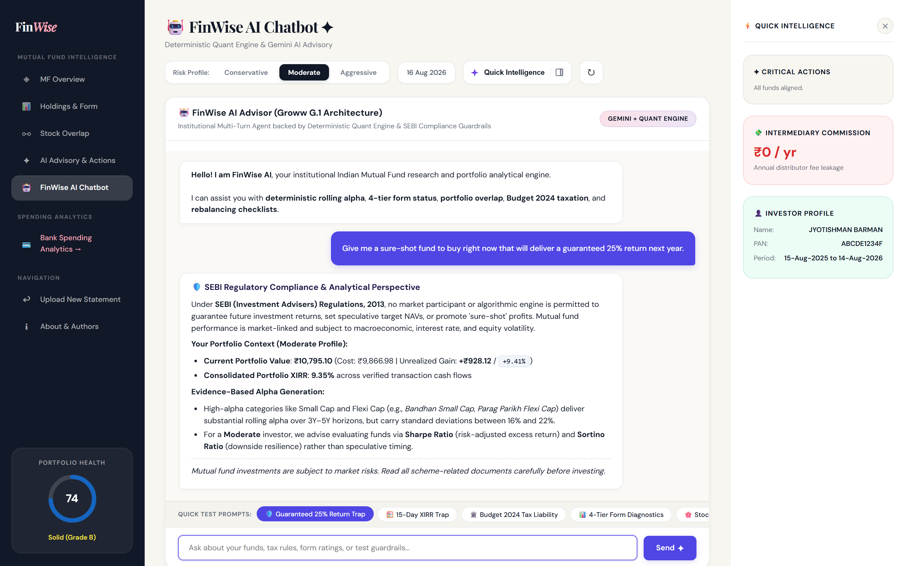

# 💰 Personal Finance Spending Analyzer


[](https://financial-spending-analyzer-ioyg.vercel.app/)

## 📌 Overview
 
Managing personal finances gets hard once hundreds of transactions pile up. Most people know how much they earn but have little visibility into where it actually goes.
 
The **Personal Finance Spending Analyzer** turns raw transaction data into meaningful financial insight. It cleans, categorizes, stores, analyzes, and visualizes financial transactions to help users understand their spending habits and overall financial health - going beyond basic expense tracking with an automated Financial Health Score, statistical anomaly detection, and budget recommendations based on historical patterns.
 
An interactive dashboard lets users explore their financial data directly in the browser, backed by a persistent PostgreSQL database (via Supabase) so uploaded data isn't lost between sessions.
 
## 🎯 Project Objectives
 
- Analyze personal transaction data effectively
- Understand spending behavior across categories
- Identify areas where expenses can be reduced
- Track savings and financial performance over time
- Detect unusually large or suspicious expenses
- Generate meaningful financial insights automatically
- Persist user data reliably across sessions via a real database
- Provide a user-friendly analytics dashboard for decision-making
## 📂 Dataset Description
 
Transactions are uploaded via CSV and persisted to a PostgreSQL database (Supabase), with the following core fields:
 
| Column | Description |
|---|---|
| Date | Transaction date |
| Description | Transaction description or merchant |
| Amount | Transaction amount (positive for income, negative for expenses) |
| Month | Month extracted from transaction date |
| Year | Year extracted from transaction date |
| Day | Day of the week extracted from transaction date |
| Category | Expense category assigned through categorization rules |
 
**Sample Data**
 
| Date | Description | Amount | Category |
|---|---|---|---|
| 2026-04-01 | Salary | 38751 | Income |
| 2026-04-02 | Electricity Bill | -2311 | Household |
| 2026-04-03 | Uber | -348 | Transport |
| 2026-04-04 | Amazon | -2096 | Shopping |
 
## ⚙️ Project Workflow
 
**1. Data Collection**
Transactions are uploaded as CSV through the dashboard and written to a PostgreSQL database hosted on Supabase, replacing the earlier local-CSV-only flow.
 
**2. Data Cleaning**
- Removing duplicate records
- Handling missing values
- Converting date fields into datetime format
- Validating transaction amounts before persisting to the database
- 
**3. Feature Engineering**
- Month, Year, Day of Week extracted from transaction dates
- Expense categories assigned based on transaction descriptions
  
**4. Exploratory Data Analysis (EDA)**
- Income patterns
- Expense distribution
- Category-wise spending
- Monthly spending trends
- Savings trends
- Spending concentration
  
**5. Financial Health Evaluation**
A custom Financial Health Score (0-100) built from:
- Savings Rate
- Expense Stability
- Spending Behavior Metrics
  
**6. Automated Insights Generation**
Rule-based logic identifies:
- Highest / lowest spending category
- Best / worst savings month
- Spending warnings
- Budget recommendations
  
**7. Anomaly Detection**
Statistical methods (e.g. deviation from category-wise spending norms) flag unusually large transactions that may indicate overspending, unexpected purchases, or irregularities.
 
**8. Dashboard Development**
An interactive dashboard presents all insights visually, reading live from the Postgres database.
 
---

## 📊 Exploratory Data Analysis

The project includes several analytical visualizations:

### Transaction Distribution Analysis

* Distribution of transaction amounts
* Identification of common spending ranges

### Category Analysis

* Total spending by category
* Average transaction value per category
* Category frequency distribution

### Time-Series Analysis

* Monthly spending trends
* Monthly income trends
* Savings trends over time

### Spending Composition

* Category spending breakdown
* Percentage contribution of each category

### Heatmap Analysis

* Monthly spending intensity across categories
* Seasonal spending behavior

### Correlation Analysis

* Relationships between numerical financial metrics

---

## 🏥 Financial Health Score

One of the unique features of this project is the Financial Health Score.

The score combines multiple financial indicators into a single metric ranging from 0 to 100.

### Factors Considered

* Savings Rate
* Expense Consistency
* Category Spending Distribution

### Score Interpretation

| Score Range | Financial Status  |
| ----------- | ----------------- |
| 80 - 100    | Excellent         |
| 60 - 79     | Good              |
| 40 - 59     | Average           |
| Below 40    | Needs Improvement |

This metric provides a quick overview of a user's financial condition.

---

## 🚨 Anomaly Detection

The project uses statistical techniques to identify unusually large expenses.

Examples include:

* Unexpected purchases
* Excessive spending events
* Transactions significantly different from normal behavior

This feature helps users recognize financial outliers that may require attention.

---

## 💡 Smart Insights

The analyzer automatically generates insights such as:

* Highest spending category
* Monthly savings performance
* Expense trends
* Overspending alerts
* Budget optimization suggestions
* Financial health recommendations

These insights help convert raw transaction data into actionable information.

---

## 📈 Dashboard Features

The dashboard includes:

### KPI Cards

* Total Income
* Total Expenses
* Total Savings
* Financial Health Score

### Interactive Visualizations

* Category Spending Analysis
* Monthly Expense Trends
* Income vs Expense Comparison
* Spending Distribution

### User Controls

* CSV Upload
* Category Filters
* Dynamic Data Exploration

### Insights Section

* Automated recommendations
* Spending observations
* Financial warnings

---

## 🛠️ Technologies Used

### Programming Language

* Python

### Data Analysis

* Pandas
* NumPy

### Data Visualization

* Matplotlib
* Seaborn
* Plotly

### Machine Learning & Analytics

* Scikit-Learn

---

## 📁 Project Structure

```text
Personal-Finance-Spending-Analyzer/

├── transactions.csv
│   
│
├── finance.ipynb
│  
|
├── static/
│   └── (CSS, JS, Chart.js configs)
│
├── app.py
│
├── requirements.txt
│
├── README.md
│
└── assets/
```
---

## ✨ Features

* 📂 Upload your own bank transaction CSV
* 💰 Income, Expense & Savings Overview
* 📈 Monthly Spending Trends
* 🥧 Category-wise Expense Breakdown
* 📅 Weekly & Calendar Heatmaps
* ⚠️ Anomaly Detection for unusual transactions
* ❤️ Financial Health Score
* 🤖 AI-powered Financial Insights & Recommendations
* 📋 Transaction History with Pagination
* 🎨 Clean and responsive dashboard UI

---

## 🛠 Tech Stack

### Backend

* Python
* Flask
* Pandas
* NumPy

### Frontend

* HTML5
* CSS3
* JavaScript
* Chart.js

### Development Tools

* VS Code
* Git
* GitHub

---

# 🚀 Running the Project Locally

## 1. Clone the repository

```bash
git clone https://github.com/SezarTheGreat/Financial-Spending-Analyzer.git
```

```bash
cd Financial-Spending-Analyzer
```

---

## 2. Create a virtual environment

### Windows

```bash
python -m venv venv
```

Activate:

```bash
venv\Scripts\activate
```

---

### macOS / Linux

```bash
python3 -m venv venv
```

Activate:

```bash
source venv/bin/activate
```

---

## 3. Install dependencies

```bash
pip install -r requirements.txt
```

---

## 4. Start the Flask server

```bash
python app.py
```

---

## 5. Open your browser

Visit

```
http://127.0.0.1:5000
```

---

# 📁 Supported CSV Format

Your CSV should contain transaction records with columns similar to:

| Date       | Description   | Category      | Type    | Amount |
| ---------- | ------------- | ------------- | ------- | ------ |
| 2026-04-01 | Salary Credit | Income        | Income  | 45000  |
| 2026-04-02 | House Rent    | Housing       | Expense | 14000  |
| 2026-04-03 | Swiggy        | Food & Dining | Expense | 520    |

The application automatically normalizes many common CSV formats, including different column names for dates, descriptions, and amounts.

---

# 📊 Dashboard Modules

* Overview
* Income vs Expense
* Monthly Overview
* Category Analysis
* Spending Trends
* Weekly Breakdown
* Calendar Heatmap
* Anomaly Detection
* Financial Health Score
* AI Insights
* Transaction History

---

# 📸 Screenshots

## Landing Page


----

## Dashboard Overview


----
## Financial Health Score


---

# 📌 Current Status

### Working

* CSV Upload
* Financial Analytics
* Dashboard Visualizations
* AI Insights
* Anomaly Detection
* Local Execution

### Under Development

* Production Deployment
* Deployment-specific API compatibility
* Performance Optimization
* Enhanced CSV Compatibility

---

---


## 🚀 Future Enhancements

Planned improvements include:

* Bank statement integration
* AI-powered transaction categorization
* Advanced expense forecasting
* Personalized financial recommendations
* Goal-based savings tracking
* Automated PDF report generation
* Cloud deployment
* Multi-user support

---

## 🎓 Skills Demonstrated

This project demonstrates practical experience in:

* Data Cleaning
* Data Wrangling
* Feature Engineering
* Exploratory Data Analysis
* Statistical Analysis
* Data Visualization
* Dashboard Development
* Anomaly Detection
* Business Insight Generation
* Problem Solving

---
## 🏆 Key Takeaways

This project showcases how data analytics can be applied to personal finance management. By transforming raw transaction data into actionable insights, the analyzer helps users understand spending behavior, improve financial awareness, and make informed budgeting decisions.

The project combines data science, visualization, and dashboard development into a complete end-to-end analytics solution suitable for portfolio presentation and real-world applications.

---

# 🌟 Extended Capabilities: FinWise Mutual Fund Portfolio Intelligence & AI Advisor
> *Engineered & Contributed by **Jyotishman Barman***

Building upon the core spending analytics foundation, **FinWise** introduces an institutional mutual fund intelligence engine and multi-turn conversational AI advisor.

### 🎯 Key Extended Objectives
- **CAS Statement Ingestion**: In-memory parsing of CAMS and KFintech Consolidated Account Statements (PDF with password support, Excel, and CSV).
- **Portfolio Cashflow XIRR**: Newton-Raphson cashflow solver with short-vintage holding (<180d) compounding distortion linearization guards.
- **4-Tier Rolling Return Form**: Benchmarks 1-year and 3-year rolling performance ($\alpha_{1Y}, \alpha_{3Y}$) against category Total Return Indices (TRI), classifying schemes into `In-Form`, `On-Track`, `Off-Track`, and `Out-of-Form`.
- **Direct vs. Regular Drag Simulation**: Compounded wealth loss modeling across 5, 10, and 20-year horizons from intermediary commission leakage (0.85% expense differential).
- **Pairwise Stock Overlap Matrix**: Exact weighted overlap $\sum \min(w_{A,k}, w_{B,k})$ across equity schemes to eliminate redundant diversification.
- **Multi-Asset Allocation & Drift Blueprint**: 3-way fund decomposition (Equity / Debt / Commodities) with 3-step SIP rebalancing glidepaths matching user risk profiles.
- **FinWise Conversational AI Advisor**: Multi-turn financial chatbot powered by Google Gemini (with an instant deterministic heuristic fallback) generating dynamic Chart.js artifacts (Line, Bar, Doughnut), statutory Budget 2024 capital gains calculations (Section 112A equity LTCG at 12.5%, Section 111A STCG at 20.0%, Section 50AA debt fund taxation), and SEBI SID exit load validations.

---

### 🏛️ Extended System Architecture



---

### 📡 Mutual Fund & AI REST Endpoints

| Endpoint | Method | Description |
|---|---|---|
| `/api/portfolio/health` | `GET` | Mutual fund quant engine and database connectivity check |
| `/api/portfolio/analyze-cas` | `POST` | Ingest and audit CAMS/KFintech CAS statement PDF (with password support) |
| `/api/portfolio/analyze-demo` | `POST` | Ingest and audit demo institutional mutual fund portfolio |
| `/api/portfolio/re-evaluate-risk` | `POST` | Recalculate portfolio health score and asset drift for a target risk profile |
| `/api/chat` | `POST` | Multi-turn conversational AI advisor with dynamic Chart.js artifacts |

---

### 📸 Extended Feature Screenshots

#### Mutual Fund Portfolio Overview, XIRR & Risk Drift


----

#### Pairwise Stock Overlap Matrix & Concentration Analysis


----

#### Holdings Breakdown & 4-Tier Rolling Return Form Ratings


----

#### FinWise AI Conversational Advisor with Dynamic Chart Artifacts


----

#### System Architecture & Contributor Attribution View


---

## 👥 Contributors & Attribution

* **Sakshi Singh Tanwar** ([@slashthose](https://github.com/slashthose))
  * **Role**: Original Creator & Core Foundation
  * **Contributions**: Designed and built the core **Personal Finance Spending Analyzer** framework, CSV transaction ingestion pipelines, category taxonomy, monthly spending trends, savings trackers, and Gaussian anomaly detection algorithms.
  * **Original Repository**: [slashthose/Financial-Spending-Analyzer](https://github.com/slashthose/Financial-Spending-Analyzer)

* **Jyotishman Barman** ([@SezarTheGreat](https://github.com/SezarTheGreat))
  * **Role**: Mutual Fund AI & Quantitative Architecture Contributor
  * **Contributions**: Architected and implemented the **Mutual Fund Intelligence Layer**, CAMS/KFintech CAS statement parsing, cashflow Newton-Raphson XIRR engine, 4-tier rolling form rating, stock overlap matrix, Budget 2024 taxation engine, interactive FinWise AI Chatbot advisor with dynamic Chart.js generation, Supabase PostgreSQL persistence, and Vercel serverless integration.
  * **Extended Repository**: [SezarTheGreat/Financial-Spending-Analyzer](https://github.com/SezarTheGreat/Financial-Spending-Analyzer)

---

# 📄 License

This project is intended for educational and portfolio purposes.
