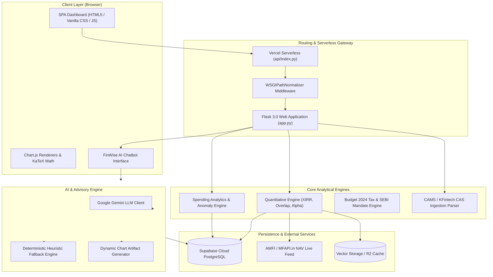

# 💰 FinWise — Personal Finance Spending & Mutual Fund AI Portfolio Analyzer

[](https://financial-spending-analyzer-ioyg.vercel.app/)
[](https://www.python.org/)
[](https://flask.palletsprojects.com/)
[](https://supabase.com/)
[](https://vercel.com/)

---

## 📌 Overview
 
Managing personal finances gets hard once hundreds of transactions pile up. Most people know how much they earn but have little visibility into where it actually goes.
 
The **Personal Finance Spending Analyzer** turns raw transaction data into meaningful financial insight. It cleans, categorizes, stores, analyzes, and visualizes financial transactions to help users understand their spending habits and overall financial health — going beyond basic expense tracking with an automated Financial Health Score, statistical anomaly detection, and budget recommendations based on historical patterns.
 
An interactive dashboard lets users explore their financial data directly in the browser, backed by a persistent PostgreSQL database (via Supabase) so uploaded data isn't lost between sessions.

In addition to bank transaction intelligence, the platform now features **FinWise Mutual Fund Portfolio Intelligence & AI Advisor**, delivering institutional-grade CAS portfolio audits, cashflow-level Newton-Raphson XIRR solvers, 4-tier rolling return form ratings, distributor expense drag simulations, stock overlap matrices, and an interactive Gemini-powered conversational advisor with dynamic Chart.js generation.
 
---

## 🎯 Project Objectives
 
- Analyze personal transaction data effectively
- Understand spending behavior across categories
- Identify areas where expenses can be reduced
- Track savings and financial performance over time
- Detect unusually large or suspicious expenses
- Generate meaningful financial insights automatically
- Persist user data reliably across sessions via a real database
- Provide a user-friendly analytics dashboard for decision-making
- Audit Consolidated Account Statements (CAS PDFs, Excel, CSV) for Indian Mutual Funds
- Evaluate portfolio performance using exact Newton-Raphson XIRR with short-vintage linearization guards
- Benchmark scheme performance using 4-tier rolling form and active alpha attribution
- Detect redundant equity diversification using pairwise weighted stock overlap matrices
- Calculate distributor commission drag (Direct vs Regular plans) over 5, 10, and 20-year horizons
- Provide real-time conversational AI financial advisory with Budget 2024 statutory tax calculations and SEBI SID exit load validations

---

## 📂 Dataset Description
 
Transactions are uploaded via CSV and persisted to a PostgreSQL database (Supabase), with the following core fields:
 
| Column | Description |
|---|---|
| Date | Transaction date |
| Description | Transaction description or merchant |
| Amount | Transaction amount (positive for income, negative for expenses) |
| Month | Month extracted from transaction date |
| Year | Year extracted from transaction date |
| Day | Day of the week extracted from transaction date |
| Category | Expense category assigned through categorization rules |
 
**Sample Data**
 
| Date | Description | Amount | Category |
|---|---|---|---|
| 2026-04-01 | Salary | 38751 | Income |
| 2026-04-02 | Electricity Bill | -2311 | Household |
| 2026-04-03 | Uber | -348 | Transport |
| 2026-04-04 | Amazon | -2096 | Shopping |
 
---

## ⚙️ Core Project Workflow

### 1. Bank Spending Analytics Workflow
 
**1. Data Collection**  
Transactions are uploaded as CSV through the dashboard and written to a PostgreSQL database hosted on Supabase, replacing the earlier local-CSV-only flow.
 
**2. Data Cleaning**  
- Removing duplicate records  
- Handling missing values  
- Converting date fields into datetime format  
- Validating transaction amounts before persisting to the database  

**3. Feature Engineering**  
- Month, Year, Day of Week extracted from transaction dates  
- Expense categories assigned based on transaction descriptions  
  
**4. Exploratory Data Analysis (EDA)**  
- Income patterns  
- Expense distribution  
- Category-wise spending  
- Monthly spending trends  
- Savings trends  
- Spending concentration  
  
**5. Financial Health Evaluation**  
A custom Financial Health Score (0-100) built from:  
- Savings Rate  
- Expense Stability  
- Spending Behavior Metrics  
  
**6. Automated Insights Generation**  
Rule-based logic identifies:  
- Highest / lowest spending category  
- Best / worst savings month  
- Spending warnings  
- Budget recommendations  
  
**7. Anomaly Detection**  
Statistical methods (e.g. deviation from category-wise spending norms) flag unusually large transactions that may indicate overspending, unexpected purchases, or irregularities.
 
**8. Dashboard Development**  
An interactive dashboard presents all insights visually, reading live from the Postgres database.

---

### 2. Mutual Fund Portfolio Intelligence & AI Workflow *(Jyotishman's Architecture)*

**1. CAS Statement Parsing & Decryption**  
Ingests CAMS and KFintech Consolidated Account Statements (CAS PDFs, Excel, CSV) in-memory with password decryption, extracting scheme names, folios, units, purchase NAVs, and valuations.

**2. Cashflow XIRR & Compounding Linearization**  
Executes Newton-Raphson cashflow solvers with short-vintage holding (<180 days) linearization guards to prevent exaggerated annualized CAGR distortions.

**3. 4-Tier Rolling Form & Active Alpha Attribution**  
Classifies schemes into `In-Form`, `On-Track`, `Off-Track`, and `Out-of-Form` by benchmarking 1-year and 3-year rolling performance ($\alpha_{1Y}, \alpha_{3Y}$) against AMFI category Total Return Indices (TRI).

**4. Direct vs. Regular Commission Drag Simulation**  
Calculates cumulative wealth loss and intermediary fee leakage over 5, 10, and 20-year horizons based on historical expense ratio differentials (0.85%).

**5. Pairwise Weighted Stock Overlap & Concentration**  
Computes exact pairwise stock overlap $\sum \min(w_{A,k}, w_{B,k})$ across equity schemes to highlight portfolio duplication and stock concentration risk.

**6. Multi-Asset Allocation & 3-Step SIP Rebalancing Blueprint**  
Decomposes holdings into Equity, Debt, and Commodities, determines drift against user risk profiles (Conservative, Moderate, Aggressive), and outlines a 3-step SIP rebalancing glidepath.

**7. FinWise Conversational AI Advisor & Dynamic Chart Generation**  
Provides multi-turn AI advisory powered by Google Gemini (with an instant deterministic fallback engine), rendering interactive Chart.js artifacts (Line, Bar, Doughnut), computing Budget 2024 capital gains tax liabilities (Section 112A equity LTCG at 12.5%, Section 111A STCG at 20.0%, Section 50AA debt fund taxation), and verifying SEBI SID exit load schedules.

---

## 📊 Exploratory Data Analysis

The project includes several analytical visualizations:

### Transaction Distribution Analysis
* Distribution of transaction amounts
* Identification of common spending ranges

### Category Analysis
* Total spending by category
* Average transaction value per category
* Category frequency distribution

### Time-Series Analysis
* Monthly spending trends
* Monthly income trends
* Savings trends over time

### Spending Composition
* Category spending breakdown
* Percentage contribution of each category

### Heatmap Analysis
* Monthly spending intensity across categories
* Seasonal spending behavior

### Correlation Analysis
* Relationships between numerical financial metrics

---

## 🏥 Financial Health Score

One of the unique features of this project is the Financial Health Score.

The score combines multiple financial indicators into a single metric ranging from 0 to 100.

### Factors Considered
* Savings Rate
* Expense Consistency
* Category Spending Distribution

### Score Interpretation

| Score Range | Financial Status  |
| ----------- | ----------------- |
| 80 - 100    | Excellent         |
| 60 - 79     | Good              |
| 40 - 59     | Average           |
| Below 40    | Needs Improvement |

This metric provides a quick overview of a user's financial condition.

---

## 🚨 Anomaly Detection

The project uses statistical techniques to identify unusually large expenses.

Examples include:
* Unexpected purchases
* Excessive spending events
* Transactions significantly different from normal behavior ($Z = (x - \mu) / \sigma > 2.0$)

This feature helps users recognize financial outliers that may require attention.

---

## 💡 Smart Insights

The analyzer automatically generates insights such as:
* Highest spending category
* Monthly savings performance
* Expense trends
* Overspending alerts
* Budget optimization suggestions
* Financial health recommendations

---

## 📈 Dashboard Modules

* **Overview**: Total Inflow, Total Outflow, Net Savings, and Savings Rate KPI cards
* **Income vs Expense**: Monthly cashflow timeseries comparison
* **Monthly Overview**: Category-wise monthly expenditure matrix
* **Category Analysis**: Expenditure breakdown and interactive doughnut charts
* **Spending Trends**: Spending velocity and historical trends
* **Weekly Breakdown**: Day-of-week spending distributions
* **Calendar Heatmap**: Visual daily spending intensity map
* **Anomaly Detection**: Two-tailed Gaussian Z-score outlier alerts
* **Financial Health Score**: Composite scoring gauge with factor breakdowns
* **Transaction History**: Paginated, searchable, and filtered transaction ledger
* **MF Portfolio Overview**: Valuation, gains, cashflow XIRR, and asset allocation
* **Holdings & Rolling Form**: 4-tier rolling CAGR ratings and active alpha attribution
* **Stock Overlap Matrix**: Pairwise scheme common stock overlap matrix
* **AI Advisor & Chatbot**: Conversational portfolio advisory with dynamic Chart.js artifacts

---

## 🏛️ System Architecture



---

## 📡 REST API Specification

### Spending & Cashflow Endpoints

| Endpoint | Method | Description |
|---|---|---|
| `/api/upload` | `POST` | Upload and normalize a bank transaction CSV |
| `/api/sample` | `GET` | Load default sample transaction dataset |
| `/api/overview` | `GET` | Retrieve total income, total expenses, net savings, and savings rate |
| `/api/categories` | `GET` | Category-wise expense aggregation and transaction counts |
| `/api/income-expense` | `GET` | Monthly income vs. expense comparison series |
| `/api/monthly` | `GET` | Monthly category expenditure matrix |
| `/api/weekly` | `GET` | Weekly spending patterns and weekday distribution |
| `/api/trends` | `GET` | Category spending trends over time |
| `/api/anomalies` | `GET` | Statistical two-tailed Gaussian Z-score outlier transactions |
| `/api/calendar` | `GET` | Daily expenditure intensity map for calendar heatmap |
| `/api/health` | `GET` | Financial Health Score (0-100) and breakdown metrics |
| `/api/insights` | `GET` | Rule-based budget recommendations and spending warnings |
| `/api/transactions` | `GET` | Paginated, searchable, and filtered transaction records |

### Mutual Fund & AI Endpoints

| Endpoint | Method | Description |
|---|---|---|
| `/api/portfolio/health` | `GET` | Check mutual fund engine and database connectivity |
| `/api/portfolio/analyze-cas` | `POST` | Parse and audit CAMS/KFintech CAS statement PDF (with optional password) |
| `/api/portfolio/analyze-demo` | `POST` | Load and audit the institutional demo mutual fund portfolio |
| `/api/portfolio/re-evaluate-risk` | `POST` | Recalculate portfolio health score and asset drift for a target risk profile |
| `/api/chat` | `POST` | Multi-turn conversational AI advisor with dynamic Chart.js generation |

---

## 📸 Visual Showcase & Screenshots

### 1. Bank Spending Analytics *(Original Core Features)*

#### Landing Page


----

#### Dashboard Overview


----

#### Financial Health Score & Spending Anomalies


---

### 2. Mutual Fund Portfolio Intelligence & AI Advisor *(Jyotishman's Extended Features)*

#### Portfolio Overview, XIRR & Risk Drift


----

#### Pairwise Stock Overlap Matrix & Concentration Analysis


----

#### Holdings Breakdown & 4-Tier Rolling Return Form Ratings


----

#### FinWise AI Conversational Advisor with Dynamic Chart Artifacts


----

#### System Architecture & Contributor Attribution


---

## 🛠️ Technology Stack

### Backend & Analytics
* **Python 3.10+**
* **Flask 3.0** (with `WSGIPathNormalizer` for serverless compatibility)
* **Pandas & NumPy** (Data cleaning, wrangling, time-series aggregations)
* **PyXIRR & Casparser** (Newton-Raphson XIRR solving, CAS PDF parsing)
* **Scikit-Learn** (Gaussian Z-score outlier detection)
* **Pydantic v2** (Strict data schema validation)

### Artificial Intelligence & Advisory
* **Google Gemini 1.5/2.0 (`google-genai`)**
* **Instructor & Structured Outputs**
* **Deterministic Heuristic Rule Engine** (Instant fallback on 429 rate limits)

### Database & Storage
* **PostgreSQL (Supabase)** (Persistent transaction & portfolio audit storage)
* **Local CSV / Memory Fallback**

### Frontend & UI
* **HTML5 & Vanilla CSS3** (Custom responsive design system, zero bloated UI libraries)
* **JavaScript (ES6+)**
* **Chart.js** (Dynamic line, bar, and doughnut charts)
* **KaTeX** (Mathematical formula rendering)

### Development & Deployment
* **Vercel Serverless Functions**
* **Git & GitHub**
* **Pytest Test Suite**

---

# 🚀 Running the Project Locally

## 1. Clone the repository

```bash
git clone https://github.com/SezarTheGreat/Financial-Spending-Analyzer.git
```

```bash
cd Financial-Spending-Analyzer
```

---

## 2. Create a virtual environment

### Windows (PowerShell)

```powershell
python -m venv venv
venv\Scripts\activate
```

### macOS / Linux

```bash
python3 -m venv venv
source venv/bin/activate
```

---

## 3. Install dependencies

```bash
pip install -r requirements.txt
```

---

## 4. Configure Environment Variables (Optional)
Create a `.env` file in the root directory:

```ini
# Gemini LLM API Key (Optional: deterministic fallback operates if omitted)
GEMINI_API_KEY="your-gemini-api-key"

# Supabase Cloud Database (Optional: local fallback operates if omitted)
SUPABASE_URL="https://your-project.supabase.co"
SUPABASE_ANON_KEY="your-supabase-anon-key"
SUPABASE_SERVICE_ROLE_KEY="your-supabase-service-role-key"
```

---

## 5. Start the Flask server

```bash
python app.py
```

---

## 6. Open your browser

Visit:
* **Landing Page**: `http://127.0.0.1:5000/`
* **Unified Dashboard**: `http://127.0.0.1:5000/dashboard`
* **Architecture & About**: `http://127.0.0.1:5000/about`

---

# 📁 Supported CSV Format

Your CSV should contain transaction records with columns similar to:

| Date       | Description   | Category      | Type    | Amount |
| ---------- | ------------- | ------------- | ------- | ------ |
| 2026-04-01 | Salary Credit | Income        | Income  | 45000  |
| 2026-04-02 | House Rent    | Housing       | Expense | 14000  |
| 2026-04-03 | Swiggy        | Food & Dining | Expense | 520    |

The application automatically normalizes many common CSV formats, including different column names for dates, descriptions, and amounts.

---

## 🧪 Testing & Verification

To run the automated test suite:

```bash
pytest
```

---

## 🎓 Skills Demonstrated

This project demonstrates practical experience in:

* Data Cleaning & Wrangling
* Feature Engineering & Time-Series Modeling
* Exploratory Data Analysis (EDA)
* Statistical Anomaly Detection (Gaussian Z-scores)
* Financial Mathematics (Newton-Raphson XIRR, Rolling Returns, Alpha Attribution)
* Portfolio Optimization (Overlap Matrix, Asset Drift, Fee Drag Simulation)
* Conversational AI & LLM Structured Tool Calling
* Full-Stack Web & Dashboard Development
* Cloud Database Persistence & Serverless Deployment

---

## 👥 Contributors & Attribution

* **Sakshi Singh Tanwar** ([@slashthose](https://github.com/slashthose))
  * **Role**: Original Creator & Core Foundation
  * **Contributions**: Designed and engineered the core **Financial Spending Analyzer** framework. Built the end-to-end bank statement parsing pipelines, category classification engine, expense trend heuristics, and statistical spending anomaly detection algorithms.
  * **Original Repository**: [slashthose/Financial-Spending-Analyzer](https://github.com/slashthose/Financial-Spending-Analyzer)

* **Jyotishman Barman** ([@SezarTheGreat](https://github.com/SezarTheGreat))
  * **Role**: Mutual Fund AI & Quantitative Architecture Contributor
  * **Contributions**: Architected and implemented the **Mutual Fund Intelligence Layer**, CAMS/KFintech CAS statement parsing, Newton-Raphson XIRR cashflow engine, 4-tier rolling form rating, stock overlap matrix, Budget 2024 taxation engine, interactive FinWise AI Chatbot advisor with dynamic Chart.js generation, Supabase PostgreSQL persistence, and Vercel serverless integration.
  * **Extended Repository**: [SezarTheGreat/Financial-Spending-Analyzer](https://github.com/SezarTheGreat/Financial-Spending-Analyzer)

---

## 🏆 Key Takeaways

This project showcases how data science, quantitative analytics, and artificial intelligence can be combined into a unified personal wealth management platform. By transforming raw transaction data and mutual fund statements into actionable intelligence, the analyzer empowers users to gain complete clarity over their spending behavior and optimize long-term portfolio returns.

---

# 📄 License

This project is open source and available under the **MIT License**. Distributed for educational and portfolio demonstration purposes.
