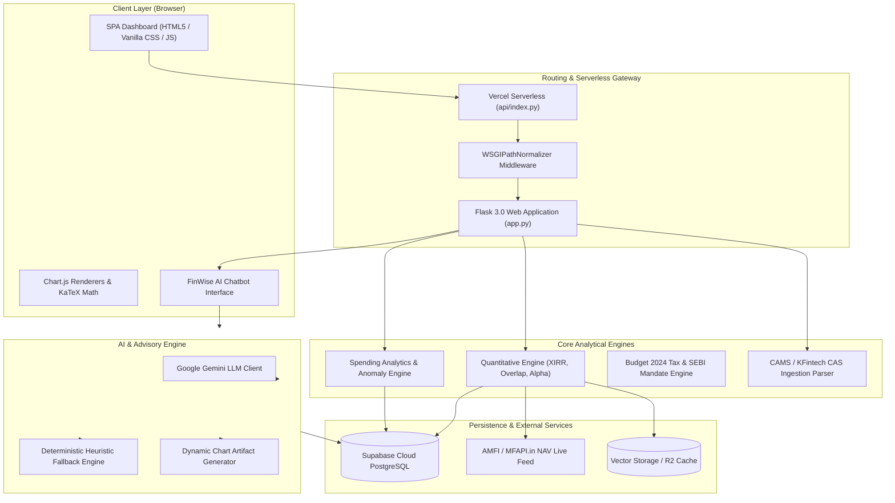
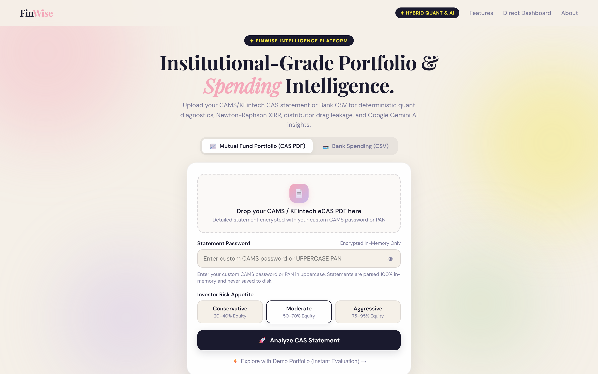
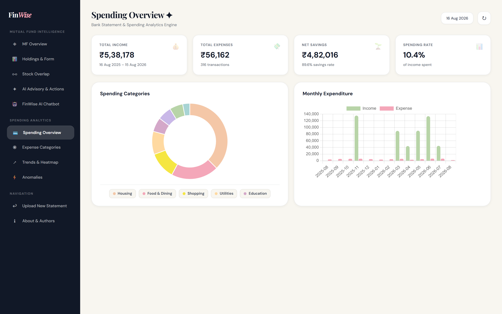
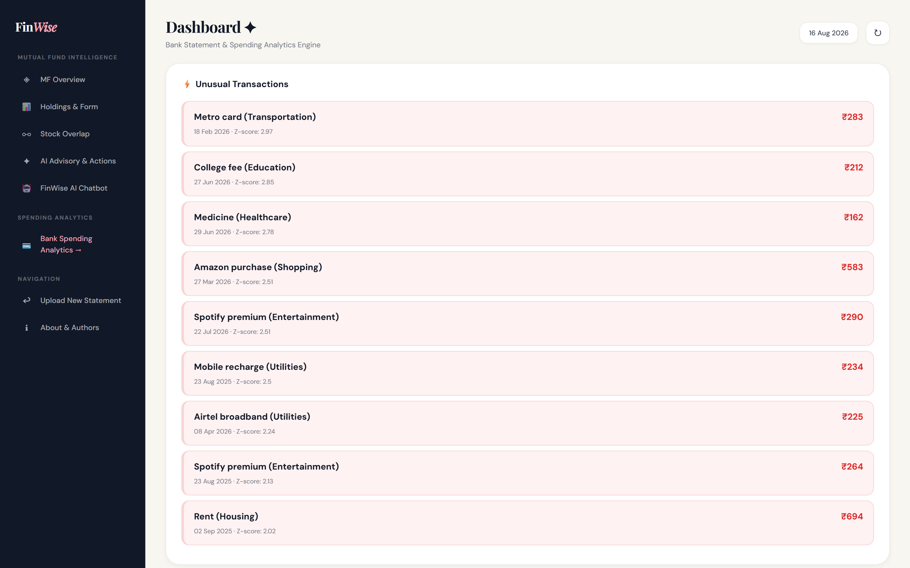

# 💰 FinWise — Financial Spending Analyzer & AI Mutual Fund Advisor

[](https://financial-spending-analyzer-ioyg.vercel.app/)
[](https://www.python.org/)
[](https://flask.palletsprojects.com/)
[](https://supabase.com/)
[](https://vercel.com/)

---

## 📌 Executive Summary

**FinWise** is an institutional-grade, full-stack personal finance and portfolio intelligence platform. It bridges the gap between daily bank transaction analytics and long-term mutual fund wealth management by combining:

1. **Personal Spending Analytics**: Ingests, categorizes, cleans, and visualizes bank transactions with statistical two-tailed Gaussian anomaly detection ($Z > 2.0$), savings rate tracking, calendar heatmaps, and rule-based spending health scores.
2. **Mutual Fund Quantitative Engine**: Parses CAMS / KFintech Consolidated Account Statements (CAS PDFs, CSVs, Excel), executes cashflow-level Newton-Raphson XIRR solvers, performs 4-tier rolling return form and alpha attribution, models pairwise weighted portfolio overlap, and calculates asset allocation drift.
3. **FinWise Conversational AI Advisor**: An intelligent, multi-turn AI assistant powered by Google Gemini (with an autonomous deterministic heuristic fallback engine). It delivers real-time portfolio advice, generates interactive Chart.js artifacts directly inside conversation streams, computes post-Budget 2024 capital gains tax obligations, and verifies SEBI Scheme Information Document (SID) exit loads.

---

## 🌟 Core Feature Suite

### 1. 💳 Bank Spending & Cashflow Intelligence
* **Flexible Ingestion & Normalization**: Universal CSV parser supporting various bank statement formats (HDFC, ICICI, SBI, Axis, etc.) with automatic column mapping, deduplication, and datetime standardization.
* **Cashflow KPI Dashboard**: Instant summary of Total Inflow, Total Outflow, Net Savings, and Savings Rate percentage.
* **Spending Breakdown & Trends**: Interactive category-wise distributions, monthly income vs. expense comparisons, and spending velocity trends.
* **Weekly & Calendar Heatmaps**: Visual day-of-week and month-by-month transaction intensity heatmaps to spot cyclical spending habits.
* **Statistical Anomaly Detection**: Flags unusual transactions using two-tailed Gaussian Z-score outlier detection ($Z = (x - \mu) / \sigma > 2.0$) categorized by risk level.
* **Automated Financial Health Score (0–100)**: Evaluates spending discipline across savings rate, expense consistency, and category concentration.
* **Transaction Ledger**: Searchable, sortable, and paginated transaction history with category filtering.

---

### 2. 📊 Mutual Fund Portfolio Analyzer & Quant Engine
* **CAS Parser (CAMS & KFintech)**: Parses standard Consolidated Account Statements (PDF with password support, Excel, and CSV) to extract scheme holdings, folios, units, purchase NAV, and current valuation.
* **Portfolio XIRR (Newton-Raphson)**: Precision cashflow solver with short-vintage holding (<180 days) compounding distortion linearization guards to prevent exaggerated annualized returns.
* **4-Tier Rolling Form & Active Alpha**: Classifies schemes into `In-Form`, `On-Track`, `Off-Track`, and `Out-of-Form` by benchmarking 1-year and 3-year rolling performance ($\alpha_{1Y}, \alpha_{3Y}$) against category Total Return Indices (TRI).
* **Direct vs. Regular Expense Drag Calculator**: Models cumulative wealth erosion and fee leakage over 5, 10, and 20-year horizons caused by distributor commissions (default 0.85% expense differential).
* **Pairwise Stock Overlap Matrix**: Calculates exact weighted underlying stock overlaps $\sum \min(w_{A,k}, w_{B,k})$ across schemes to eliminate redundant diversification.
* **Multi-Asset Allocation & Drift Blueprint**: Decomposes hybrid holdings into Equity, Debt, and Commodities, evaluates drift against user risk profiles (Conservative, Moderate, Aggressive), and generates a 3-step SIP rebalancing roadmap.
* **Real Estate (REIT) & Geographic Exposure Audit**: Verifies real estate exposure and isolates foreign/global technology allocations without keyword false-positives.
* **Calibrated Portfolio Health Score (0–100)**: Mathematical scoring calibrated with continuous proportional risk drift, asset allocation alignment, and quantitative drag penalties.

---

### 3. 🤖 FinWise Conversational AI Advisor
* **Multi-Turn Advisory**: Natural language financial analysis across both mutual fund holdings and bank spending data.
* **Embedded Chart Generation**: Generates live Chart.js artifacts (Line, Bar, Doughnut) inside chat streams with automated Cartesian scale normalization.
* **Statutory Tax Engine (Budget 2024)**:
  * **Section 112A (Equity LTCG)**: 12.5% on gains exceeding the ₹1.25 Lakh annual exemption (holding period > 12 months).
  * **Section 111A (Equity STCG)**: 20.0% flat tax on short-term holdings.
  * **Section 50AA (Specified Debt Funds)**: Taxed at marginal income tax slab rates without indexation for investments made after April 1, 2023.
* **SEBI SID Compliance & Exit Load Verification**: Accurately advises on fund-specific exit loads (e.g., SBI Ultra Short Duration 0.00% NIL, Parag Parikh Flexi Cap tiered 2%/1%/NIL exit loads, Bandhan Small Cap 1% < 1 year).
* **Deterministic Fallback & Fast-Fail Architecture**: Resilient dual-layer query router that provides instant heuristic responses when external AI APIs encounter `429 RESOURCE_EXHAUSTED` rate limits.
* **Sequential Markdown & Math Engine**: Formats outputs with continuous numbered lists across sub-bullets and isolated KaTeX math rendering.

---

## 🏛️ System Architecture



---

## 🛠️ Technology Stack

| Layer | Technologies |
|---|---|
| **Backend & APIs** | Python 3.10+, Flask 3.0, Pydantic v2, PyXIRR, HTTPX, Aiohttp |
| **Data & Quant Analytics** | Pandas, NumPy, Scikit-Learn, Casparser, PyPDF, OpenPyXL |
| **Artificial Intelligence** | Google Gemini 1.5/2.0 (`google-genai`), Instructor, Regex Rule-Engine |
| **Database & Persistence** | PostgreSQL (Supabase), Local CSV Fallback Engine |
| **Frontend & UI** | Semantic HTML5, Vanilla CSS3 (Custom Design System), JavaScript (ES6+), Chart.js, KaTeX |
| **Infrastructure & Cloud** | Vercel Serverless Functions, Cloudflare R2 / S3 Storage |
| **Testing & CI** | Pytest, Adversarial Quant Test Harness, Automated Prompt E2E Suite |

---

## 📂 Repository Structure

```text
Financial-Spending-Analyzer/
├── api/
│   └── index.py               # Vercel serverless WSGI entrypoint
├── app.py                     # Main Flask web application & REST API routes
├── core/                      # Application configuration, Gemini client, & query router
├── db/                        # Database adapters, session management, & migrations
├── ingestion/                 # Bank statement CSV ingestion & schema validators
├── mcp_servers/               # MCP tools for CAS synchronization & chart sandboxing
│   ├── cas_sync/
│   └── chart_sandbox/
├── mf_analyzer/               # Institutional Mutual Fund Analysis Suite
│   ├── ai_engine.py           # LLM advisor synthesis & prompt engineering
│   ├── cas_parser.py          # CAMS / KFintech PDF & Excel statement parser
│   ├── chatbot_engine.py      # Dual-mode AI chatbot, heuristics & tax rules
│   ├── market_data.py         # AMFI NAV client & historical data cache
│   ├── quant_engine.py        # Newton-Raphson XIRR, overlap & rolling alpha math
│   ├── rules.py               # SEBI compliance, exit loads, & tax schedules
│   └── schemas.py             # Pydantic models for portfolios and audit responses
├── quant_service/             # Dedicated quantitative microservice modules
├── static/
│   ├── css/
│   │   ├── dashboard.css      # Dashboard styling & responsive layout
│   │   └── style.css          # Core styles & design tokens
│   ├── js/
│   │   ├── app.js             # Spending dashboard interactions
│   │   └── dashboard.js       # Chart.js bindings, chat streaming & markdown parser
│   └── favicon.svg            # FinWise application favicon
├── supabase/                  # Supabase schema definitions & migration scripts
├── templates/
│   ├── about.html             # Architecture & contributor attribution page
│   ├── dashboard.html         # Unified single-page application (Spending + MF)
│   └── index.html             # Landing page
├── tests/                     # Comprehensive test suite
│   ├── test_all_user_prompts.py # 100% Institutional prompt verification
│   ├── test_chatbot_api.py      # Multi-turn chat & chart contract tests
│   ├── test_quant_engine.py     # Math, XIRR, and overlap assertions
│   └── test_adversarial_quant.py# Extreme-case & adversarial quant tests
├── transactions.csv           # Default sample bank transactions dataset
├── vercel.json                # Vercel serverless routing & header rules
├── requirements.txt           # Production Python dependencies
├── pytest.ini                 # Pytest configuration
└── README.md                  # Project documentation
```

---

## 📡 REST API Specification

### Spending & Cashflow Endpoints

| Endpoint | Method | Description |
|---|---|---|
| `/api/upload` | `POST` | Upload and normalize a bank transaction CSV |
| `/api/sample` | `GET` | Load the default sample transaction dataset |
| `/api/overview` | `GET` | Retrieve total income, total expense, savings, and savings rate |
| `/api/categories` | `GET` | Aggregate total expenditure and transaction count by category |
| `/api/income-expense` | `GET` | Retrieve monthly inflow vs. outflow timeseries data |
| `/api/monthly` | `GET` | Category-wise monthly expenditure matrix |
| `/api/weekly` | `GET` | Day-of-week and week-number spending distributions |
| `/api/trends` | `GET` | Category spending trends over time |
| `/api/anomalies` | `GET` | Statistical two-tailed Gaussian Z-score outlier transactions |
| `/api/calendar` | `GET` | Daily expenditure intensity map for calendar heatmap rendering |
| `/api/health` | `GET` | Financial Health Score (0-100) and breakdown metrics |
| `/api/insights` | `GET` | Rule-based budget recommendations and spending warnings |
| `/api/transactions` | `GET` | Paginated, searchable, and filtered transaction records |

---

### Mutual Fund & Quant Endpoints

| Endpoint | Method | Description |
|---|---|---|
| `/api/portfolio/health` | `GET` | Check mutual fund engine and database connectivity |
| `/api/portfolio/analyze-cas` | `POST` | Upload and parse CAMS/KFintech CAS PDF (with optional password) |
| `/api/portfolio/analyze-demo` | `POST` | Load and audit the institutional demo portfolio |
| `/api/portfolio/re-evaluate-risk` | `POST` | Recalculate portfolio health score and asset drift for a new risk profile |

---

### FinWise AI Chatbot Endpoint

#### `POST /api/chat`

Handles conversational financial queries across spending and investment domains.

**Request Schema:**
```json
{
  "message": "What is my portfolio XIRR and how does it compare to benchmark?",
  "session_id": "optional-uuid-v4",
  "audit_id": "optional-audit-uuid",
  "history": [
    { "role": "user", "content": "Hello" },
    { "role": "assistant", "content": "How can I help you analyze your finances today?" }
  ],
  "risk_profile": "Moderate"
}
```

**Response Schema:**
```json
{
  "reply": "Your portfolio XIRR stands at **16.42%**...",
  "chart": {
    "type": "line",
    "title": "Portfolio Cashflow vs Cumulative Valuation",
    "data": {
      "labels": ["Apr 2024", "Jul 2024", "Oct 2024", "Jan 2025"],
      "datasets": [
        {
          "label": "Net Invested (₹)",
          "data": [100000, 250000, 400000, 550000],
          "borderColor": "#F4A7B9",
          "backgroundColor": "rgba(244, 167, 185, 0.1)"
        }
      ]
    }
  },
  "session_id": "uuid-v4",
  "risk_profile": "Moderate"
}
```

---

## 🚀 Local Installation & Setup

### 1. Prerequisites
* Python 3.10 or higher
* Git
* Supabase Account (optional for local CSV mode, recommended for cloud persistence)
* Google Gemini API Key (optional, deterministic fallback will activate if absent)

---

### 2. Clone the Repository
```bash
git clone https://github.com/SezarTheGreat/Financial-Spending-Analyzer.git
cd Financial-Spending-Analyzer
```

---

### 3. Create & Activate a Virtual Environment

**Windows (PowerShell):**
```powershell
python -m venv venv
venv\Scripts\activate
```

**macOS / Linux:**
```bash
python3 -m venv venv
source venv/bin/activate
```

---

### 4. Install Dependencies
```bash
pip install -r requirements.txt
```

---

### 5. Configure Environment Variables
Create a `.env` file in the project root based on `.env.example`:

```ini
# Gemini LLM API Key (Optional)
GEMINI_API_KEY="your-gemini-api-key"

# Supabase Cloud Database (Optional)
SUPABASE_URL="https://your-project.supabase.co"
SUPABASE_ANON_KEY="your-supabase-anon-key"
SUPABASE_SERVICE_ROLE_KEY="your-supabase-service-role-key"

# Cloudflare R2 / S3 Storage (Optional)
R2_BUCKET_NAME="mutual-fund-lancedb"
R2_ACCOUNT_ID="your-r2-account-id"
R2_ACCESS_KEY_ID="your-r2-access-key-id"
R2_SECRET_ACCESS_KEY="your-r2-secret-access-key"
R2_ENDPOINT="https://your-r2-account-id.r2.cloudflarestorage.com"
```

---

### 6. Run the Application
```bash
python app.py
```

Access the interface in your browser:
* **Landing Page**: `http://127.0.0.1:5000/`
* **Unified Dashboard**: `http://127.0.0.1:5000/dashboard`
* **Architecture & About**: `http://127.0.0.1:5000/about`

---

## 🧪 Testing & Verification

The repository contains an automated end-to-end and unit testing suite covering quantitative calculations, tax schedules, prompt handling, and edge cases.

To run all tests:
```bash
pytest
```

To run individual test modules:
```bash
# Test all institutional AI chatbot prompts & charts
pytest tests/test_all_user_prompts.py -v

# Test quantitative financial math (XIRR, Overlap, Drag)
pytest tests/test_quant_engine.py -v

# Test adversarial edge cases and error bounds
pytest tests/test_adversarial_quant.py -v
```

---

## 📸 Screenshots

| Landing & Ingestion | Unified Analytics Dashboard |
|:---:|:---:|
|  |  |

| Financial Health Scoring |
|:---:|
|  |

---

## 👤 Contributor & Attribution

* **Lead Architect & Developer**: [Jyotiraditya Mahanta](https://github.com/SezarTheGreat)
* **Project**: FinWise AI & Financial Spending Analyzer
* **Live Deployment**: [financial-spending-analyzer-ioyg.vercel.app](https://financial-spending-analyzer-ioyg.vercel.app/)

---

## 📄 License

This project is open source and available under the **MIT License**. Distributed for educational and portfolio demonstration purposes.
